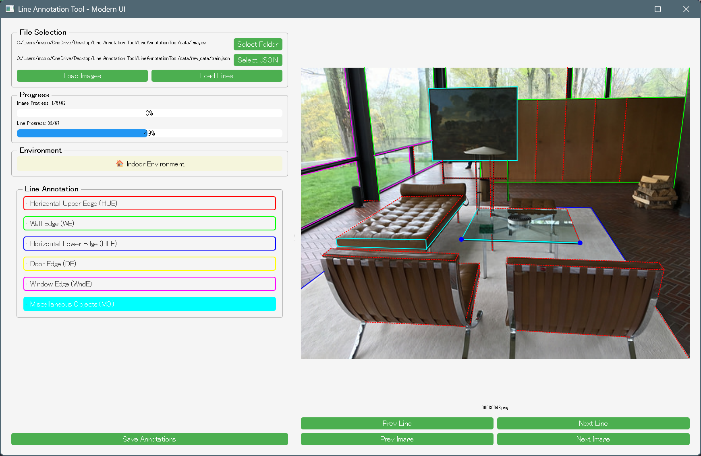

# LineAnnotationTool
Wireframe line annotation tool 

## Description
This is a wireframe line annotation tool that allows you to draw lines on an image. It is built using PyQt5 and OpenCV. The tool provides a simple interface for annotating images with lines, which can be useful for various applications such as image processing, computer vision, and machine learning.

## Features
- Draw lines on an image by clicking and dragging the mouse.
- Save the annotated image with lines as a new file.
